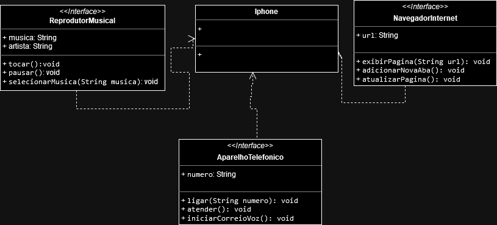

📋 Desafio Modelando o iPhone com UML: Funções de Músicas, Chamadas e Internet

O projeto visa implementar um UML de um aparelho que possua as seguintes funções:

- 🎶 Reprodutor Musical
- 📞 Aparelho Telefônico
- 🌐 Navegador na Internet

<html>
	<body>
		

					
      

	</body>
</html>

